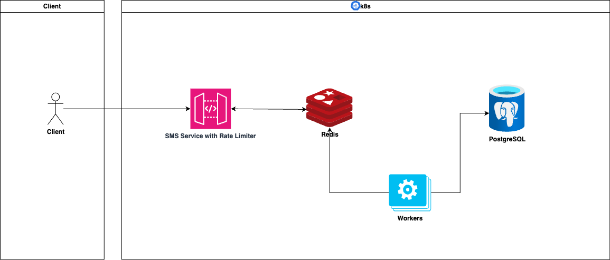
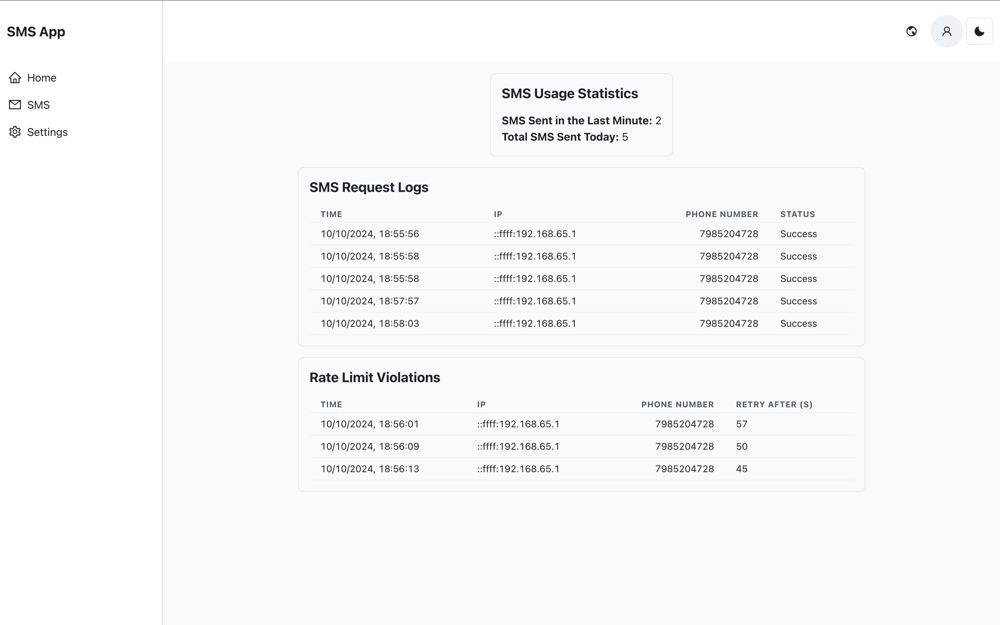
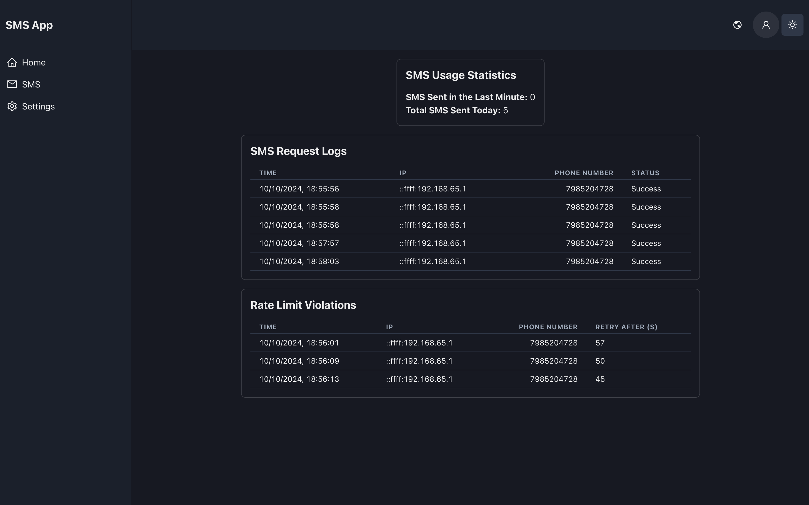

---

# SMS APP

## Overview



This project implements a **rate-limited SMS API** alongside a **React-based dashboard** for monitoring SMS usage and rate limits in real-time. The system is designed to handle public-facing API requests efficiently while ensuring rate limits are respected, logs are persistently stored, and real-time metrics are available for monitoring.

I designed this solution with performance, scalability, and user experience in mind, leveraging **Redis** for high-speed operations and **PostgreSQL** for persistent storage.

### Features
- **Rate Limiting**: Each client (identified by IP address and phone number) can send up to:
  - 3 SMS requests per minute.
  - 10 SMS requests per day.
  
- **Throttling**: When a client exceeds their rate limits, the API responds with a `429 Too Many Requests` status and a `Retry-After` header, informing the client when they can send another request.

- **Real-Time Monitoring Dashboard**: The React-based dashboard allows users to:
  - View current SMS usage statistics.
  - See recent rate limit violations in real-time.
  - Send test SMS messages and get instant feedback.

---

## My Approach

### 1. **Rate Limiting and Log Management with Redis**

I used **Redis** as both a **rate limiter** and a **temporary log store** for fast, in-memory operations. Redis is perfectly suited for this because of its speed and ability to handle high-frequency operations efficiently.

- **Rate Limiting**: Redis tracks each client’s SMS requests in real-time, storing counts for both the per-minute and per-day limits. If a client exceeds these limits, Redis quickly flags the violation, and the API sends back a throttled response.
  
- **Log Storage**: All SMS requests and rate limit violations are temporarily stored in Redis. This gives us a quick way to access logs in real-time for the dashboard while avoiding the performance hit of directly writing logs to a relational database.

### 2. **Workers and PostgreSQL for Persistence**

To keep Redis memory usage in check and ensure **long-term persistence**, I use worker processes that:
- **Periodically (every 10 minutes)** query Redis to retrieve all logs (both SMS requests and rate limit violations).
- **Dump these logs into PostgreSQL** for persistent storage.

By doing this, Redis acts as a real-time log buffer while PostgreSQL stores logs for historical analysis and auditing. This also helps in freeing up Redis memory, ensuring it remains lean and responsive.

### 3. **Real-Time Dashboard**

I built a **React dashboard** that receives logs from Redis, allowing users to see their SMS request history and any rate limit violations in **real-time**.

- The dashboard interacts with the server, fetching the latest data from Redis, which ensures that users have the most up-to-date view of their SMS activities.
- The logs, once persisted in PostgreSQL, are also available for longer-term insights, but the dashboard prioritizes Redis data for real-time performance.

---

## Why This Approach?

### **Advantages**:

1. **Real-Time Data**:
   - Redis’s in-memory nature makes it the perfect candidate for real-time operations. Both rate limiting and log retrieval happen instantly, ensuring that users can get immediate feedback on their actions.

2. **Scalability**:
   - By decoupling real-time log storage (Redis) from persistent storage (PostgreSQL), the system can scale horizontally. Redis handles the high-throughput operations, and workers can process logs in the background without slowing down the main API.

3. **Efficient Memory Management**:
   - Using **log expiry** in Redis ensures that logs are automatically cleared after a set period, preventing Redis from being overwhelmed with old data. By offloading logs to PostgreSQL every 10 minutes, we maintain Redis’s high performance while keeping a long-term record in a relational database.

4. **User-Friendly Dashboard**:
   - The React dashboard offers an intuitive and simple interface for monitoring SMS usage in real-time. Users can quickly see their request history, detect rate limit violations, and even test the API through the UI.

---

## Further Improvements

While this design works well, there’s always room for improvement:

1. **More Granular Log Expiry**:
   - Currently, all logs in Redis expire after a set period. We could implement more fine-grained expiration strategies, where critical logs (like rate limit violations) stay longer, and less important logs (like successful SMS requests) expire sooner.

2. **Finer Monitoring and Alerts**:
   - The system could be enhanced by adding monitoring and alerts for when Redis or PostgreSQL are approaching resource limits. For example, we could set up notifications if Redis memory usage is getting too high or if PostgreSQL query times are slowing down.

3. **Increased Fault Tolerance**:
   - Adding redundancy in case Redis or the workers fail would be a valuable improvement. Implementing **Redis replication** or clustering, along with automatic retries for workers, would help ensure the system is robust in case of crashes or outages.

4. **Historical Data in the Dashboard**:
   - Right now, the dashboard pulls data from Redis for real-time stats. Adding the ability to fetch and display **historical data** from PostgreSQL would allow users to get insights over days or even weeks, making it a more powerful tool.

---

## Conclusion

This project combines the power of **Redis** for high-speed, real-time operations with the reliability of **PostgreSQL** for persistent storage. The architecture strikes a balance between performance and persistence, making it suitable for a high-frequency, public-facing API. The **React dashboard** adds a user-friendly layer on top, providing transparency into how the rate limiting works and giving users immediate access to their usage data.

Feel free to clone the repo and try it out! If you have any questions, don’t hesitate to reach out.

---

### Setup Instructions

(Provide instructions here for cloning the repo, installing dependencies, and running the project locally.)
- Download Docker https://www.docker.com
- To test the API import SMS API.postman_collection.json in your Postman (Optional)
- Commands
```bash
docker compose up
```
- React App is avaiable at: http://localhost:3000
---

### Dashboard


<br>
<br>


---

### Note
Assumptions were made:
<br>
As it is realtime on every visit to app the last fresh log is displayed.
To see live logs coming open two tabs in parallel.
- http://localhost:3000/
- http://localhost:3000/sms

---
**Thank you for reading!** Feel free to contribute, suggest improvements, or use this architecture in your own projects.